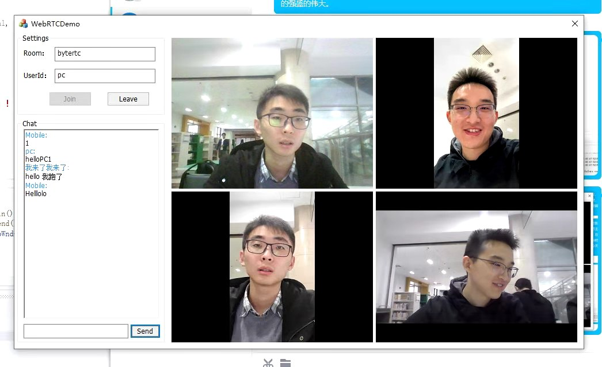

2020-11-10:
增加了国内可用的STUN服务器，提高了连通率
修改IceTransportsType，去除本机IP选项

# 作业说明

## 目标

1. 实现多人通话功能
2. 实现多人聊天功能

### 多人通话功能

#### demo中关键函数理解

首先对多人通话中涉及的部分关键函数进行分析：

* `void CRtcWinDemoDlg::AddTrack(webrtc::VideoTrackInterface* track, bool is_local)`是实现加流的关键函数。它首先对待加入的`track`进行检查，如果其类型为`kVideoKind`且该`track`未曾加入，则加入该流，并调用`HWND AllocateWindow(bool is_local, std::string track_id)`为其分配对应的窗口。
* `HWND AllocateWindow(bool is_local, std::string track_id)`是为流分配窗口的函数。它首先预分配一个窗口，然后检测该窗口是否已被其他流占用，如果未被占用，则窗口分配成功，否则分配失败，返回`NULL`．

对**本地流**，`rtc_manageer.cpp`中的`CreateLocalMediaStream()` 函数触发`receiver_->AddTrack(video_track_, true);`传出的`true`参数代表`is_local = true`，即该流为本地流。

对**远程流**，`rtc_manageer.cpp`中的`PeerConnectionObserver()`函数触发`receiver_->AddTrack(video_track, false)`;传出的`false`参数代表`is_local = false`，即该流为远程流。

#### 多人通话实现思路

##### 窗口加入流

在`RtcWinDemoDlg.cpp`初始代码中，`AllocateWindow()`已实现了为本地流和第一个远程流的加流和分配窗口操作：为本地流分配第一个窗口，远程流分配第二个窗口。参考第一个远程流的相关操作，增加额外的远程流，即可实现多人通话功能。主要修改函数为`AllocateWindow()`，对于远程流，依次检查窗口二、三、四的占用情况，如果未被占用，则分配成功，并标记为已被占用，否则检查下一个窗口。修改后的该函数如下

```python
HWND CRtcWinDemoDlg::AllocateWindow(bool is_local, std::string track_id) {
	CWnd* pWnd = NULL;
	if (is_local) {
		pWnd = GetDlgItem(IDC_LOCAL_WIN);
	} else {
		if (!win1Used) {
			pWnd = GetDlgItem(IDC_REMOTE_WIN_1);
			win1Used = true;
		}
		else if (!win2Used) {
			pWnd = GetDlgItem(IDC_REMOTE_WIN_2);
			win2Used = true;
		}
		else if (!win3Used) {
			pWnd = GetDlgItem(IDC_REMOTE_WIN_3);
			win3Used = true;
		}
		
		if (pWnd) {
			auto it = map_of_video_renders_.begin();
			while (it != map_of_video_renders_.end()) {
				if (it->second->GetWindow() == pWnd->GetSafeHwnd()) {
					return NULL;
				}
				it++;
			}
		}
	}
	return pWnd ? pWnd->GetSafeHwnd() : NULL;
}
```

##### 窗口退出流

添加`SetWinUsed(HWND window)`函数，该函数将输入的这个window的标记设为未被占用。

```python
void CRtcWinDemoDlg::SetWinUsed(HWND window) {
	CWnd* pWnd = NULL;
	pWnd = GetDlgItem(IDC_REMOTE_WIN_1);

	if (window == pWnd->GetSafeHwnd()) {
		win1Used = false;
	}
	else {
		pWnd = GetDlgItem(IDC_REMOTE_WIN_2);
		if (window == pWnd->GetSafeHwnd()) {
			win2Used = false;
		}
		else {
			pWnd = GetDlgItem(IDC_REMOTE_WIN_3);
			if (window == pWnd->GetSafeHwnd()) {
				win3Used = false;
			}
		}
	}
}
```

在`RemoveTrack`函数中进行调用`SetWinUsed`，修改后的该函数如下

```python
void CRtcWinDemoDlg::RemoveTrack(webrtc::VideoTrackInterface* track) {
	if (track && track->kind() == webrtc::MediaStreamTrackInterface::kVideoKind) {
		std::string track_id = track->id();
		auto it = map_of_video_renders_.find(track_id);
		if (it != map_of_video_renders_.end()) 
			SetWinUsed(map_of_video_renders_[track_id]->GetWindow()); {
			it->second->SetTrack(nullptr);
			map_of_video_renders_.erase(it);
		}
	}
}
```

### 多人聊天功能

根据demo中的`onReceiveMessage`函数可以看到response消息类和其他消息类的接收处理，其中其他消息类中可以看到有一个method为broadcast的消息处理函数，根据该函数就可以设计发信息的json内容格式，由于是主动信息，将notification改为request即可。从输入框获取信息，并在最后需要将输入框进行清空处理。

```python
void CRtcWinDemoDlg::OnBnClickedBtnSend()
{
	CString strMessage, strRoomId, strUserName;
	m_editRoomId.GetWindowText(strRoomId);
	m_editUserId.GetWindowText(strUserName);
	m_editMessage.GetWindowText(strMessage);

	if (strMessage.IsEmpty()) {
		AfxMessageBox(_T("Invalid Message"));
		return;
	}

	room_id_ = CStringToStdString(strRoomId);
	user_name_ = CStringToStdString(strUserName);

	cJSON* root_json = cJSON_CreateObject();

	cJSON_AddItemToObject(root_json, "request", cJSON_CreateBool(true));
	cJSON_AddItemToObject(root_json, "id", 			cJSON_CreateNumber(AllocateSession(kWebSocketRequestJoinRoom, user_id_)));
	cJSON_AddItemToObject(root_json, "method", cJSON_CreateString("broadcast"));

	cJSON* data_json = cJSON_CreateObject();
	cJSON_AddItemToObject(root_json, "data", data_json);
	cJSON_AddItemToObject(data_json, "rid", cJSON_CreateString(room_id_.c_str()));
	cJSON_AddItemToObject(data_json, "uid", cJSON_CreateString(user_id_.c_str()));

	cJSON* info_json = cJSON_CreateObject();
	cJSON_AddItemToObject(data_json, "info", info_json);
	cJSON_AddItemToObject(info_json, "msg", cJSON_CreateString(CStringToStdString(strMessage).c_str()));
	cJSON_AddItemToObject(info_json, "senderName", cJSON_CreateString(user_name_.c_str()));

	//这一步是把发送的信息显示到聊天内容，会重复显示两次本机发出去的信息
	//OnChatMessage(root_json);

	char* request = cJSON_Print(root_json);
	cJSON_Delete(root_json);

	LogPrintf(request);
	if (websocket_ && request) {
		websocket_->sendMessage(std::make_shared<std::string>(request));
	}

	if (request) {
		cJSON_free(request);
		//清空输入框
		m_editMessage.SetWindowText(NULL);
	}

	//不需要改变按键状态
	//GetDlgItem(IDC_BTN_SEND)->EnableWindow(TRUE);
}
```
### 实现效果

